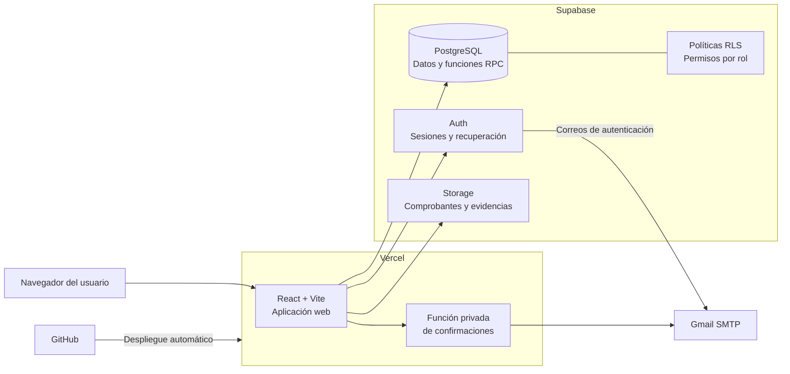

# Guía de VendeloTodo para el equipo de QA

## 1. Propósito de esta guía

Esta guía permite que una persona que no participó en el desarrollo comprenda qué hace VendeloTodo, cómo está construido y cómo ejecutar pruebas funcionales de manera segura.

La aplicación contiene datos y escenarios preparados para prácticas académicas de Quality Assurance. El objetivo de los compañeros es explorar el sistema, diseñar casos de prueba, registrar resultados y reportar cualquier diferencia entre el comportamiento esperado y el observado.

Esta guía **no revela los defectos intencionales** incluidos para la actividad.

## 2. Enlaces principales

| Recurso | Dirección |
|---|---|
| Aplicación publicada | <https://vendelotodo.vercel.app/> |
| Repositorio | <https://github.com/luisferucat/vendelotodo> |
| Supabase del proyecto | `https://spkjbhzutrnjnebemutl.supabase.co` |
| Correo del proyecto | `vedelotodoucat@gmail.com` |

No se necesita acceso a GitHub, Vercel o Supabase para ejecutar pruebas de caja negra en la aplicación publicada.

## 3. ¿Qué es VendeloTodo?

VendeloTodo es una aplicación web para una empresa simulada de la Zona Norte de Costa Rica. Reúne cuatro áreas de negocio:

- venta y consulta de productos de ferretería, electrodomésticos, repuestos y aire acondicionado;
- solicitud de servicios handyman y aire acondicionado;
- gestión interna de cotizaciones, órdenes, inventario, proveedores, pagos y reseñas;
- trabajo de campo para técnicos asignados.

El cliente puede consultar el sitio, cotizar y solicitar un servicio sin crear una cuenta. Solamente el personal interno debe iniciar sesión.

## 4. Alcance del Release 1

### Incluido

- catálogo público con búsqueda, categorías, disponibilidad y detalle;
- servicios de fontanería, electricidad, instalaciones y aire acondicionado;
- cotizador público con productos y servicios;
- solicitudes de visita técnica;
- correos de confirmación de cotizaciones y órdenes;
- recuperación y restablecimiento de contraseña;
- registro de comprobantes SINPE para revisión manual;
- reseñas con moderación administrativa;
- administración de productos, inventario y proveedores;
- asignación y programación de órdenes;
- portal del técnico, cambios de estado y evidencia fotográfica;
- autorización por roles Administrador y Técnico.

### Fuera de alcance

- WhatsApp;
- cobros bancarios automáticos;
- aplicación móvil nativa;
- notificaciones push;
- registro público de cuentas de personal.

## 5. Arquitectura utilizada



### Componentes técnicos

| Capa | Tecnología | Responsabilidad |
|---|---|---|
| Interfaz | React 18, Vite y CSS responsive | Formularios, páginas, navegación y mensajes en español |
| Rutas | React Router | Rutas públicas y portales protegidos por rol |
| Hosting | Vercel | Publicación del frontend y función de correo |
| Autenticación | Supabase Auth | Inicio de sesión, sesión activa y recuperación de contraseña |
| Datos | Supabase PostgreSQL | Productos, órdenes, cotizaciones, pagos, reseñas y usuarios |
| Seguridad | Row Level Security | Restringe operaciones según sesión y rol |
| Archivos | Supabase Storage | Comprobantes SINPE y evidencia de trabajos |
| Correos | Supabase SMTP y función Vercel con Gmail | Autenticación y confirmaciones transaccionales |
| Control de versiones | GitHub | Código fuente e historial de cambios |

El frontend usa una clave pública de Supabase. Las credenciales privadas de Gmail y las claves administrativas nunca se envían al navegador.

## 6. Roles y accesos QA

| Rol | Correo | Contraseña | Página inicial |
|---|---|---|---|
| Administrador | `admin@vendelotodo.test` | `AdminQA2026!` | `/admin` |
| Técnico 1 | `tecnico1@vendelotodo.test` | `TecnicoQA2026!` | `/tecnico` |
| Técnico 2 | `tecnico2@vendelotodo.test` | `TecnicoQA2026!` | `/tecnico` |

Estas son cuentas compartidas únicamente para QA. Los dominios `.test` no tienen un buzón real y, por tanto, no reciben mensajes de recuperación.

Reglas para las cuentas compartidas:

- no cambiar sus contraseñas;
- no desactivar la cuenta que se está utilizando;
- cerrar sesión al cambiar de rol;
- registrar en la evidencia qué usuario se utilizó;
- coordinar las pruebas que cambien órdenes o inventario, porque los cambios son visibles para todo el grupo.

La cuenta asociada al correo del proyecto es administrativa y su contraseña no forma parte de esta guía. Solo debe utilizarla la persona responsable del proyecto.

## 7. Correos que pueden utilizarse en pruebas

### Cotizaciones y órdenes públicas

Cada compañero puede escribir su propio correo real en los formularios. No se necesita crear una cuenta en VendeloTodo.

Para separar mensajes, una persona con Gmail puede usar alias como:

```text
correo.personal+vendelotodo-cotizacion@gmail.com
correo.personal+vendelotodo-orden@gmail.com
```

Los mensajes llegarán al mismo buzón de `correo.personal@gmail.com`. Cada persona debe sustituir el ejemplo por una dirección que controle.

También puede usarse `vedelotodoucat@gmail.com` como destinatario de pruebas únicamente cuando el responsable del proyecto haya autorizado el acceso o pueda confirmar la recepción.

### Confirmación de cuenta y recuperación de contraseña

Para probar estos mensajes se necesita una cuenta real previamente creada en Supabase Auth con un correo al que el probador tenga acceso. Las cuentas terminadas en `.test` sirven para iniciar sesión, pero no reciben correos.

Si se necesita este escenario, el responsable debe crear una cuenta temporal con el correo real del compañero y asignarle un perfil de Técnico. No se deben compartir contraseñas personales ni credenciales de Supabase.

### Qué comprobar en los correos

- que llegue al destinatario indicado;
- que identifique correctamente el trámite realizado;
- que muestre el número generado por la aplicación;
- que los datos coincidan con los enviados;
- que no exponga contraseñas ni claves internas;
- que el enlace de recuperación dirija al dominio publicado;
- que el mensaje sea legible en computadora y teléfono;
- que no llegue duplicado al realizar una sola operación.

Revise Recibidos, Spam y, cuando el destinatario sea también el remitente, la carpeta Enviados.

## 8. Recorridos principales

### Cliente público

No requiere inicio de sesión.

1. Consultar el catálogo y abrir el detalle de un producto.
2. Buscar y filtrar por categoría o disponibilidad.
3. Consultar los servicios ofrecidos.
4. Crear una cotización y comprobar el total y el correo.
5. Solicitar una visita técnica y conservar el número de orden.
6. Enviar una reseña, que debe quedar pendiente de moderación.
7. Registrar un comprobante SINPE para revisión administrativa.

### Administrador

1. Iniciar sesión con la cuenta Administrador QA.
2. Revisar el resumen operativo y sus accesos directos.
3. Crear o editar productos y comprobar validaciones.
4. Registrar entradas y salidas de inventario.
5. Consultar alertas por bajo stock.
6. Gestionar proveedores.
7. Asignar una orden a un técnico activo y programar una fecha futura.
8. Editar cotizaciones permitidas.
9. Confirmar o rechazar pagos pendientes.
10. Aprobar o rechazar reseñas.
11. Consultar y activar o desactivar usuarios internos.

### Técnico

1. Iniciar sesión con el técnico al que el Administrador asignó la orden.
2. Comprobar que solamente pueda ver sus trabajos.
3. Avanzar la orden por esta secuencia:

```text
Asignada → En camino → En progreso → Completada
```

4. Intentar completar sin evidencia y comprobar la validación.
5. Cargar una imagen JPG, PNG o WEBP menor de 8 MB.
6. Completar el trabajo y comprobar que ya no permita nuevos avances.

## 9. Datos preparados para QA

El catálogo contiene escenarios distintos para pruebas de equivalencia y límites:

| Escenario | Ejemplo |
|---|---|
| Stock normal | Taladro inalámbrico 20V |
| Stock exactamente en el mínimo | Tubo PVC 1/2 pulgada |
| Stock cero | Llave ajustable 8 pulgadas |
| Bajo pedido | Capacitor para AC 35µF |
| Aire acondicionado disponible | AC inverter 12.000 BTU |
| Aire acondicionado bajo pedido | AC inverter 18.000 BTU |
| Producto inactivo | Producto antiguo QA, que no debe aparecer públicamente |

También existen órdenes, pagos, cotizaciones y reseñas en diferentes estados. No se debe asumir una cantidad fija, porque las pruebas de otros compañeros pueden crear nuevos registros.

## 10. Convenciones para datos nuevos

Para que los registros sean reconocibles, utilice el prefijo `QA`, sus iniciales y la fecha:

```text
Nombre: QA-LF-20260808
Notas: QA-LF-Caso límite de inventario
Referencia SINPE: QA-LF-001
Dirección: QA - Dirección simulada de al menos diez caracteres
```

Puede utilizar `88887777` como teléfono ficticio. No use números bancarios, direcciones, comprobantes o fotografías personales reales.

Para archivos cargue únicamente material creado para pruebas:

- comprobante: JPG, PNG o PDF menor de 5 MB;
- evidencia técnica: JPG, PNG o WEBP menor de 8 MB.

## 11. Prueba de humo recomendada

Ejecute esta lista antes de una sesión de pruebas más extensa:

- [ ] La página inicial abre por HTTPS.
- [ ] El catálogo carga productos activos.
- [ ] Es posible abrir el detalle de un producto.
- [ ] Los filtros pueden combinarse y limpiarse.
- [ ] El cotizador calcula subtotales y total.
- [ ] Una cotización válida genera un número `COT-AAAA-NNNN`.
- [ ] Una solicitud válida genera un número `OT-AAAA-NNNN`.
- [ ] Los correos de ambas operaciones son recibidos.
- [ ] El Administrador puede iniciar y cerrar sesión.
- [ ] El Técnico puede iniciar y cerrar sesión.
- [ ] Un Técnico no puede abrir rutas `/admin`.
- [ ] El Administrador no accede al portal técnico como si fuera Técnico.
- [ ] Una salida mayor al stock es rechazada.
- [ ] Una reseña nueva no aparece públicamente antes de aprobarse.
- [ ] Recargar una ruta interna no produce error 404.
- [ ] No aparecen errores inesperados en pantalla.

## 12. Pruebas negativas sugeridas

- campos obligatorios vacíos;
- espacios al inicio o final;
- mayúsculas, minúsculas, tildes, números y caracteres especiales;
- teléfono con siete y nueve dígitos;
- correo sin `@`, sin dominio o con espacios;
- fechas en el pasado;
- cantidades cero, negativas, decimales y muy grandes;
- stock insuficiente;
- archivos con extensión, tipo o tamaño no permitido;
- referencia SINPE repetida;
- navegación directa a rutas de otro rol;
- doble clic sobre botones de envío;
- recarga, botón Atrás y sesión expirada.

## 13. Plantilla mínima para un caso de prueba

| Campo | Contenido |
|---|---|
| ID | `TC-MODULO-001` |
| Requisito | RF relacionado |
| Título | Comportamiento que se comprobará |
| Prioridad | Alta, media o baja |
| Precondiciones | Estado y usuario necesarios |
| Datos | Valores exactos utilizados |
| Pasos | Acciones numeradas |
| Resultado esperado | Comportamiento correcto según el requisito |
| Resultado obtenido | Evidencia observada |
| Estado | Passed, Failed, Blocked o Not Run |

## 14. Plantilla mínima para reportar un defecto

```text
ID: BUG-MODULO-001
Título:
Ambiente: https://vendelotodo.vercel.app/
Navegador y versión:
Rol utilizado:
Precondiciones:
Pasos para reproducir:
1.
2.
3.
Resultado esperado:
Resultado actual:
Frecuencia: Siempre / Intermitente / Una vez
Severidad: Crítica / Alta / Media / Baja
Evidencia: captura, video, número COT/OT y hora aproximada
```

No incluya contraseñas, claves, cookies de sesión, contraseñas de aplicación de Gmail ni datos personales en la evidencia.

## 15. Criterios generales de resultado esperado

- los mensajes deben estar en español y explicar el error de manera comprensible;
- los importes deben mostrarse en colones costarricenses;
- las fechas no deben desplazarse un día por zona horaria;
- la aplicación debe conservar coherencia entre la pantalla pública, Administración y Técnico;
- un error de correo no debe eliminar una cotización u orden ya guardada;
- las acciones protegidas deben respetar el rol autenticado;
- los registros inactivos no deben mostrarse al cliente;
- una operación fallida no debe aplicarse parcialmente;
- la interfaz debe poder usarse en escritorio y teléfono.

## 16. Cierre de la sesión de pruebas

1. Guarde los números de cotización y orden creados.
2. Adjunte evidencias y resultados a los casos de prueba.
3. Cierre sesión en las cuentas internas.
4. Informe qué registros fueron modificados para evitar conflictos.
5. No borre datos compartidos ni cambie la configuración de Supabase, Vercel o Gmail.
